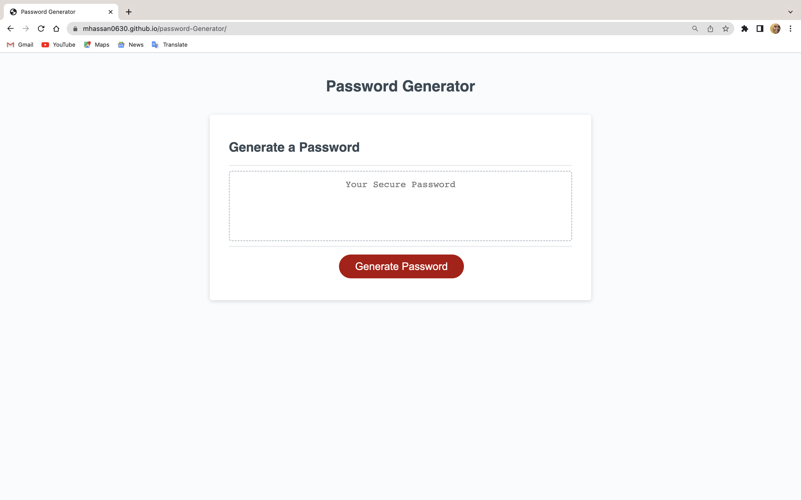

Password Generator
Description
This is a password generator, a tool that creates strong, hard-to-guess passwords to protect your online accounts. The generated passwords are resistant to automated brute force attacks. By using this password generator, you can enhance the security of your personal and financial information.

During the generation process, you can specify the length of the password and the character types it should include.

## Table of Contents
1. Installation
2. Usage

## Installation

Clone the repository to your local machine using git clone <repository-url>
Navigate to the cloned repository in your terminal
Open the index.html file in your preferred browser to start using the password generator

## Usage

1. Click the "Generate Password" button to start the password generation process.
2. A prompt will appear asking for the desired length of the password (between 8 and 128 characters).
3. Confirmations will appear asking if you want to include lowercase letters, uppercase letters, numbers, and special characters in your password.
4. Based on your preferences, a password will be generated and displayed on the screen.

