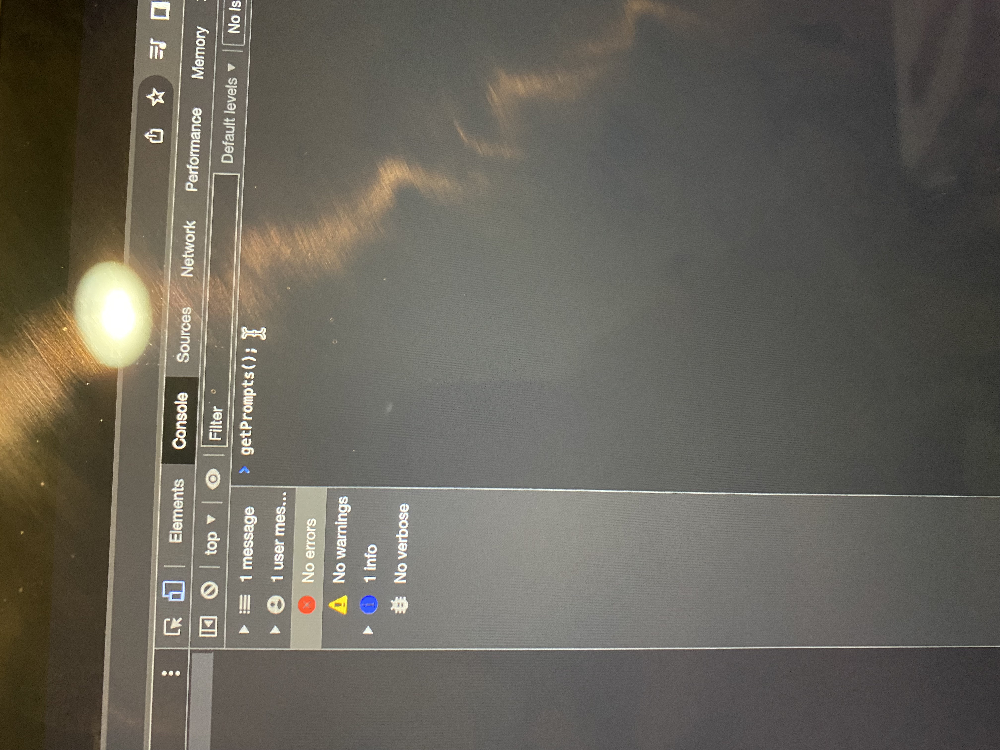
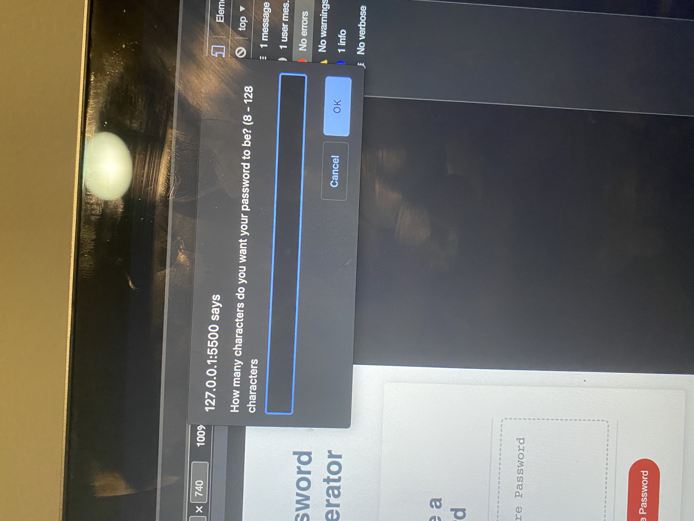

<Your-Project-Title>

## Description

A password generator is a tool that creates a new, strong password for you to use to protect your online accounts. The purpose of using a password generator is to create a password that is difficult for others to guess or crack. This is important because hackers and cybercriminals often use automated tools to try to guess or "brute force" their way into accounts by trying to guess the passwords. If you use a strong, unique password that is not easily guessable, it can help to protect your accounts from these types of attacks. To use a password generator, you typically need to provide some basic information, such as the length of the password you want and any specific characters or requirements that the password must contain. The password generator will then create a new password for you to use.

- My motivation was to see if I was able to generate a password without running into any problems.
- I build this project to see if I was able to generate a password, and if i was aable to provide the knowledge I recieved frm this lesson in class, to see if I was able to put it into generating a website.
- I learned that It is generally a good idea to use a password generator to create strong, unique passwords for all of your important online accounts. This can help to protect your personal and financial information from being accessed by unauthorized individuals. It is also a good idea to periodically change your passwords to further increase security.

## Table of Contents (Optional)

If your README is long, add a table of contents to make it easy for users to find what they need.

- [Installation](#installation)
- [Usage](#usage)
- [Credits](#credits)
- [License](#license)

## Installation

I started off with my variables at top of my script.js- things that I know I’ll need to have 
I need character length, which is what I’m going to be able to store, so I stored how long the password is going to be by starting it off by assigning it to be 8. As an assumption I assume it’ll change whenever I ask into a question into it. That will justify my default setting. Next, I’m going to have a variable called choice Array which will be where I’ll store all the possible letters or symbols I can use when I’m creating the password. Another thing I did was make a couple Arrays: special Array, lowercase Array, Upper case Array and numbers Array. 

Next, I moved on to Generate Password.
I would generate the password based on the prompts; based on what the user wants me to make a password of.
I also wrote one more function that’s called: function get Prompts- that’s where I would get all my information from. 
Inside function prompt I’m asking the person how many characters they want in their password by asking them. 
When I do this print it will be returned not as a number but as a string. Then I’ll save that into my character length. By asking them I take the string that they answer with, and I turn that into an integer.  To make sure they gave me a good number I create a Nan determining true or false. I made my Nan character length is less than 8 and the character length is strictly greater than 128. 
After that I am going to confirm when I do the prompt would it like lowercase, special characters, uppercase, and numbers of letters in their password. I’m going to take their answer (which would be true or false) and if it’s that is true then I’m going to look at my choice Array then I’m going to concatenate the choice Array with the lowercase letters’ either true or false. 
I hit open live server and hit inspect and touch console and type: get Prompts (); and choiceArr.
Next, I go back to my script.JS and go back to my getPrompts function and reset choice array to be an empty array-that way It’ll reset. Now this will affect my choice array and it will return true or false. 
Then I went back to my password. 
I did getPrompts, which will return true or false. 
If it returns false, then they didn’t do the right password. I added correct prompts would be true or false depending on if they did their password right: true or false. 

Next how would he generate a password? 
I’m going to create a string called password numbness -an empty string. Then I did a for loo: “I is less than character length. This look will keep going for however long the character length I set up to be. I created a math random letter, which is going to create a value a floating-point value from 0 to 0.99 multiplying it by the choice Array length.
Now my password I can set it to equal to password - whatever it was there before plus choice Array with some random index. Once I do that, choice array will be some random symbol from that array and I’m going to add it to password and then store the new value back into password. After I get done with the loop I’m going to return to password. 

## Usage

Provide instructions and examples for use. Include screenshots as needed.

To add a screenshot, create an `assets/images` folder in your repository and upload your screenshot to it. Then, using the relative filepath, add it to your README using the following syntax:

    ]
 ]
         
]

]

    

